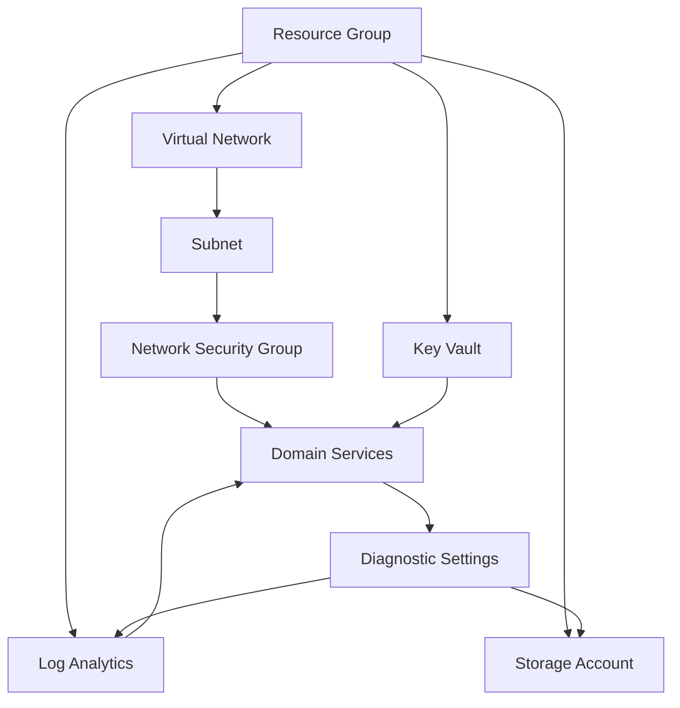

# Architecture Guide

## Overview

This Terraform template creates a comprehensive Microsoft Entra Domain Services infrastructure with security, monitoring, and high availability features.

## Architecture Diagram

```
┌─────────────────────────────────────────────────────────────────────┐
│                           Azure Subscription                        │
├─────────────────────────────────────────────────────────────────────┤
│  Resource Group: ${var.resource_group_name}                        │
│                                                                     │
│  ┌─────────────────────────────────────────────────────────────┐    │
│  │                    Virtual Network                          │    │
│  │                                                             │    │
│  │  ┌─────────────────────────────────────────────────────┐    │    │
│  │  │              Domain Services Subnet                │    │    │
│  │  │                                                     │    │    │
│  │  │  ┌─────────────────────────────────────────────┐    │    │    │
│  │  │  │       Microsoft Entra Domain Services      │    │    │    │
│  │  │  │                                             │    │    │    │
│  │  │  │  • Primary Domain Controller                │    │    │    │
│  │  │  │  • Secondary Domain Controller (HA)        │    │    │    │
│  │  │  │  • LDAP/LDAPS Services                      │    │    │    │
│  │  │  │  • Password Hash Sync                       │    │    │    │
│  │  │  └─────────────────────────────────────────────┘    │    │    │
│  │  │                                                     │    │    │
│  │  │  ┌─────────────────────────────────────────────┐    │    │    │
│  │  │  │         Network Security Group              │    │    │    │
│  │  │  │                                             │    │    │    │
│  │  │  │  • LDAP (636) - Inbound                     │    │    │    │
│  │  │  │  • LDAPS (636) - Inbound                    │    │    │    │
│  │  │  │  • PowerShell Remoting (5986) - Inbound    │    │    │    │
│  │  │  │  • RDP (3389) - Inbound                     │    │    │    │
│  │  │  └─────────────────────────────────────────────┘    │    │    │
│  │  └─────────────────────────────────────────────────────┘    │    │
│  └─────────────────────────────────────────────────────────────┘    │
│                                                                     │
│  ┌─────────────────────────────────────────────────────────────┐    │
│  │                     Key Vault                              │    │
│  │                                                             │    │
│  │  • SSL Certificates                                        │    │
│  │  • Service Credentials                                     │    │
│  │  • Connection Strings                                      │    │
│  └─────────────────────────────────────────────────────────────┘    │
│                                                                     │
│  ┌─────────────────────────────────────────────────────────────┐    │
│  │                  Log Analytics Workspace                   │    │
│  │                                                             │    │
│  │  • Security Logs                                           │    │
│  │  • Audit Logs                                              │    │
│  │  • Performance Metrics                                     │    │
│  │  • Diagnostic Data                                         │    │
│  └─────────────────────────────────────────────────────────────┘    │
│                                                                     │
│  ┌─────────────────────────────────────────────────────────────┐    │
│  │                   Storage Account                          │    │
│  │                                                             │    │
│  │  • Diagnostic Logs                                         │    │
│  │  • Backup Data                                             │    │
│  │  • Audit Trail                                             │    │
│  └─────────────────────────────────────────────────────────────┘    │
└─────────────────────────────────────────────────────────────────────┘
```

## Component Details

### Microsoft Entra Domain Services
- **Type**: Managed Azure AD Domain Services
- **Implementation**: AzAPI provider (required for latest features)
- **Features**:
  - Fully managed domain controllers
  - LDAP/LDAPS protocols
  - Group Policy management
  - Domain join capabilities
  - Password hash synchronization

### Network Infrastructure
- **Virtual Network**: Dedicated VNet for isolation
- **Subnet**: Specialized subnet for domain services
- **Network Security Group**: Restrictive security rules
- **Address Space**: Configurable CIDR ranges

### Security Components
- **Key Vault**: Centralized secret management
- **Network Security**: Least privilege access
- **Encryption**: TLS/SSL for all communications
- **Access Control**: Azure RBAC integration

### Monitoring & Logging
- **Log Analytics**: Centralized log collection
- **Diagnostic Settings**: Comprehensive telemetry
- **Security Alerts**: Automated threat detection
- **Performance Monitoring**: Resource utilization tracking

## High Availability Architecture

### Replica Sets (Optional)
```
Primary Region              Secondary Region
┌─────────────────────┐     ┌─────────────────────┐
│   Domain Services   │────▶│   Replica Set       │
│   Primary           │     │   Secondary         │
│                     │     │                     │
│   • Read/Write      │     │   • Read Only       │
│   • Authentication │     │   • Authentication  │
│   • LDAP/LDAPS     │     │   • LDAP/LDAPS      │
└─────────────────────┘     └─────────────────────┘
```

### Benefits
- **Disaster Recovery**: Cross-region replication
- **Load Distribution**: Regional service availability
- **Performance**: Reduced latency for remote users
- **Compliance**: Data residency requirements

## Security Architecture

### Network Security
```
Internet
    │
    ▼
┌─────────────────────┐
│   Network Security  │
│   Group             │
│                     │
│   Rules:            │
│   • LDAP: 389       │
│   • LDAPS: 636      │
│   • PS Remoting     │
│   • RDP (mgmt)      │
└─────────────────────┘
    │
    ▼
┌─────────────────────┐
│   Domain Services   │
│   Subnet            │
│                     │
│   • Isolated        │
│   • Private IPs     │
│   • Service Endpts  │
└─────────────────────┘
```

### Access Control
- **Azure RBAC**: Role-based access control
- **Service Principals**: Application authentication
- **Managed Identity**: Secure Azure service access
- **Key Vault Integration**: Secret management

## Data Flow

### Authentication Flow
```
1. User Request
   │
   ▼
2. Application
   │
   ▼
3. Domain Services (LDAP/LDAPS)
   │
   ▼
4. Azure AD Sync
   │
   ▼
5. User Validation
   │
   ▼
6. Authentication Response
```

### Monitoring Flow
```
1. Domain Services Events
   │
   ▼
2. Diagnostic Settings
   │
   ▼
3. Log Analytics Workspace
   │
   ▼
4. Azure Monitor Alerts
   │
   ▼
5. Notification Actions
```

## Deployment Patterns

### Standard Deployment
- Single region
- Basic monitoring
- Standard security
- Development/testing workloads

### High Availability Deployment
- Multi-region replica sets
- Advanced monitoring
- Enhanced security
- Production workloads

### Enterprise Deployment
- Global replica sets
- Comprehensive monitoring
- Maximum security
- Mission-critical workloads

## Resource Dependencies



## Scalability Considerations

### Vertical Scaling
- **SKU Upgrades**: Standard to Premium
- **Compute Resources**: Automatic scaling
- **Storage**: Dynamic expansion

### Horizontal Scaling
- **Replica Sets**: Regional distribution
- **Load Balancing**: Automatic traffic distribution
- **Performance Tiers**: Workload optimization

## Integration Points

### Azure Services
- **Azure AD**: Identity synchronization
- **Virtual Machines**: Domain join
- **Azure Files**: Kerberos authentication
- **Azure SQL**: AD authentication

### Third-Party Services
- **LDAP Applications**: Direct integration
- **Legacy Systems**: Authentication bridge
- **SSO Solutions**: Identity federation
- **Monitoring Tools**: Log export

## Performance Characteristics

### Latency
- **Local Region**: < 10ms
- **Cross Region**: < 100ms
- **Global**: < 200ms

### Throughput
- **Authentication Requests**: 10,000/second
- **LDAP Queries**: 50,000/second
- **Synchronization**: Real-time

### Availability
- **SLA**: 99.95%
- **RTO**: < 4 hours
- **RPO**: < 1 hour